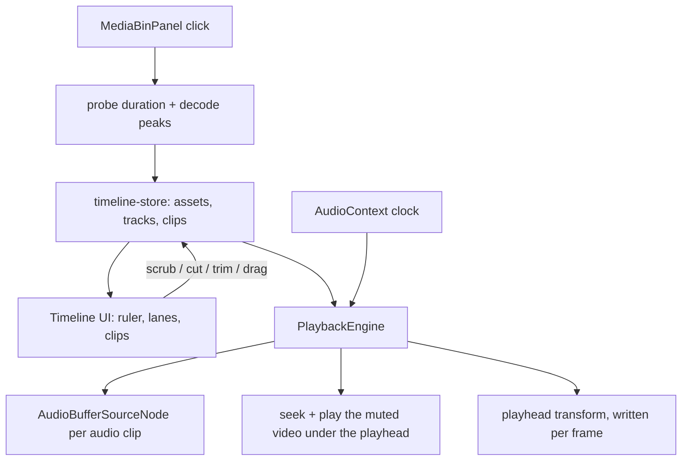

# Editor: Preview Player & Timeline

How the editing surface works: clicking a clip in the media bin puts it on a timeline, the timeline drives a preview, and audio and video can be cut and moved independently.

## Playback architecture



### The clock is audio, not video

`AudioContext.currentTime` is the master clock ([`transport.ts`](../src/features/editor/playback/transport.ts)). A `<video>` element's own `currentTime` cannot serve as the timeline clock once clips are cut and rearranged — it restarts at every clip boundary, and it stalls during seeks. Running off the audio clock also means picture follows the audio device rather than wall time, so long takes don't drift against their sound.

Before the first user gesture the browser may keep the context suspended, so the transport falls back to `performance.now()` and re-anchors as soon as audio starts running.

### Picture follows

[`useVideoSync.ts`](../src/features/editor/playback/useVideoSync.ts) keeps one `<video>` element per asset used on `V1`, mounted and muted. Each frame it finds the clip under the playhead, fades in that element, and drives it to `sourceIn + (playhead - clip.start)`:

- drift over 100 ms → hard seek
- drift between 20 and 100 ms → small `playbackRate` trim (inaudible, the element is muted)
- under 20 ms → left alone
- while scrubbing → `fastSeek` when available, skipping frames where a seek is still in flight

### Sound comes from the audio track

[`useAudioEngine.ts`](../src/features/editor/playback/useAudioEngine.ts) schedules an `AudioBufferSourceNode` per audio clip against the same clock the transport reads, with a per-clip `GainNode` carrying short edge fades so cuts don't click. That gain node is where auto-ducking and silence removal will hang.

Web Audio is used rather than `<audio>` elements because the buffers already exist for waveform drawing, and because element-based playback can't start a clip at an exact sample offset.

If `decodeAudioData` can't handle a file, the asset is marked `waveform: "unavailable"`: the clip still edits normally, renders a flat line instead of a waveform, and its sound comes from the (now unmuted) video element.

### Nothing re-renders at 60fps

The playhead position, the timecode, and picture sync are written straight to the DOM from a clock subscription. Drag previews live in [`drag-state.ts`](../src/features/editor/timeline/drag-state.ts), a small external store, so pointer moves neither touch the project state nor enter undo history.

## Project model

[`src/types/timeline.ts`](../src/types/timeline.ts) holds the model; [`timeline-store.ts`](../src/stores/timeline-store.ts) is the single source of truth for the project.

- `MediaAsset` — a file pulled into the project: path, playable URL, duration, and waveform status.
- `Clip` — `start` on the timeline plus `sourceIn` and `duration` inside the asset. `linkedId` points at the video/audio sibling created from the same file.
- `Track` — `V1` (video), `A1` (source audio), `A2 Voice`. `A2` ships empty so a generated voice take can be dropped in without touching the timeline.

Clicking a bin item appends a linked pair at the end of the sequence. Audio-only files (`.wav`, `.mp3`, `.m4a`, …) are listed too and append a single audio clip.

Every mutation is a pure function in [`ops.ts`](../src/lib/timeline/ops.ts), so the store stays thin:

| Operation | Behaviour |
|---|---|
| `splitClips` | Cuts clips straddling a time. The left half keeps the original id so other clips' links stay valid; the right half is only re-linked when its sibling was cut too. |
| `moveClips` | Shifts a group by one shared delta so linked audio and video can't drift apart. On collision the delta snaps to the nearest free edge; if nothing near is free the move is rejected rather than corrupting the track. |
| `trimClip` | Drags one edge, clamped to available source media and to the neighbouring clips. |
| `removeClips` | Deletes and drops dangling links. |

Undo/redo is a snapshot stack of `{ clips, selectedIds }` inside the store — no middleware, and view state like zoom stays out of history.

## Interactions

| Action | Input |
|---|---|
| Play / pause | `Space` |
| Frame step | `←` / `→` (`Shift` for 10) |
| Previous / next edit | `↑` / `↓` |
| Start / end | `Home` / `End` |
| Split at playhead | `S` or the scissors button |
| Delete selection | `Delete` / `Backspace` |
| Undo / redo | `Cmd+Z` / `Shift+Cmd+Z` |
| Toggle snapping | `N` |
| Toggle linked A/V | `L` |
| Zoom | `+` / `-`, or `Cmd`+wheel (anchored on the cursor) |
| Scrub | Drag the ruler or the playhead handle |
| Move a clip | Drag its body; `Alt` ignores the A/V link |
| Trim | Drag either clip edge |
| Multi-select | `Shift`+click |

Cutting audio on its own is the point of the separate tracks: with linking on, selecting either half of a pair cuts both; with linking off (or `Alt`), only the clip you selected is affected.

Vertical drags are counted within tracks of the clip's own kind, so dragging the audio of a linked pair down to `A2` leaves the picture on `V1` instead of blocking the whole group.

## Playing local files

`<video>` cannot load an absolute path directly. [`asset-url.ts`](../src/lib/media/asset-url.ts) routes paths through `convertFileSrc`, which needs the asset protocol enabled in [`tauri.conf.json`](../src-tauri/tauri.conf.json):

```json
"security": {
  "assetProtocol": {
    "enable": true,
    "scope": { "requireLiteralLeadingDot": false, "allow": ["$HOME/**"] }
  }
}
```

Without this the WebView silently refuses the URL. Range requests — needed for seeking — are supported by Tauri's asset protocol on macOS and Windows, but not on Linux/WebKitGTK, where video over `asset://` does not work at all.

## Browser dev harness

The editor runs in a plain browser without building the Tauri shell, which is useful for iterating on the timeline:

```bash
mkdir -p public/dev-media   # gitignored
# drop a few .mp4 / .wav files in, then list them:
echo '["take-a.mp4"]' > public/dev-media/manifest.json
pnpm dev
```

When `isTauri()` is false, **Select Folder** reads that manifest instead of opening the native dialog ([`dev-media.ts`](../src/lib/media/dev-media.ts)). The native dialog and `asset://` streaming still need `pnpm tauri dev` to exercise.

## Known limits and next steps

- **Whole-file reads for waveforms.** Peaks are decoded by fetching the entire file, which is heavy for a 2K source. The fix is the FFmpeg sidecar from [ffmpeg-backend.md](./ffmpeg-backend.md) emitting a compact mono wav plus cached peaks — the same extraction the voice pipeline needs.
- **Frame rate is a project setting** (default 30). Real per-file fps needs `ffprobe`; frame stepping and snapping use the project value until then.
- **Only `V1` composites.** The model supports any number of tracks, but the preview renders one video track.
- Peak computation runs on the main thread (tens of milliseconds per clip) and would move to a worker if it ever becomes noticeable.
- No export yet. The clip model is the input to a future FFmpeg `filter_complex` render.
