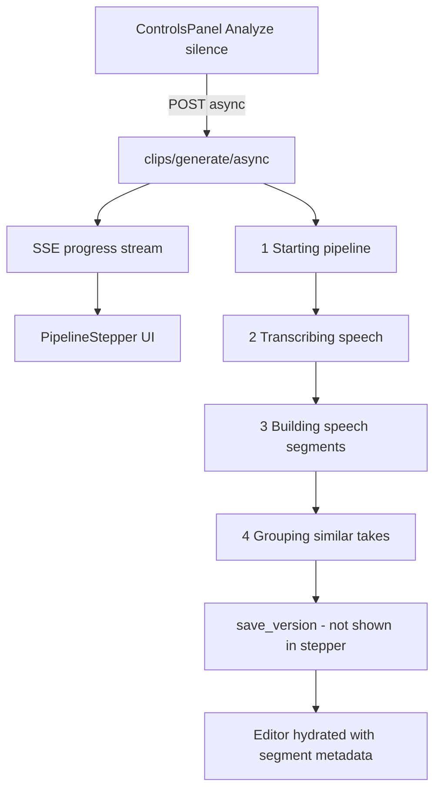

# Pipeline Stages

This document describes each stage of the **Analyze silence** pipeline — the four steps shown in the editor's `PipelineStepper` while processing runs. For the underlying silence-removal algorithm, API endpoints, and persisted state layout, see [silence-removal.md](./silence-removal.md).

## Overview

When you click **Analyze silence** in the editor controls panel, Krayon starts an async job that transcribes speech, identifies kept segments, builds segment metadata, and groups repeated takes. Clip preview plays **source video ranges** (`sourceStart` → `sourceEnd`) — no per-segment MP4 files are cut. Progress streams back to the UI in real time.

| Layer | Location |
|-------|----------|
| UI trigger | [`ControlsPanel.tsx`](../src/frontend/components/layout/ControlsPanel.tsx) |
| Stepper display | [`PipelineStepper.tsx`](../src/frontend/components/player/PipelineStepper.tsx) |
| Step definitions | [`silence-store.ts`](../src/frontend/stores/silence-store.ts) `PIPELINE_STEP_DEFS` |
| Job orchestrator | [`clips.py`](../src/backend/app/routers/clips.py) `_generate()` |
| Progress weighting | [`pipeline_progress.py`](../src/backend/app/services/pipeline_progress.py) |

**API flow:**

```http
POST /api/clips/generate/async   → { "jobId": "..." }
GET  /api/clips/progress/{jobId} → text/event-stream (SSE)
```



---

## Progress model

The stepper shows two progress values:

| Field | Scope | Meaning |
|-------|-------|---------|
| `stepProgress` | Current stage only | 0.0 → 1.0 within the active phase |
| `progress` | Entire pipeline | Weighted overall percentage |

Overall progress is computed in [`pipeline_progress.py`](../src/backend/app/services/pipeline_progress.py) by mapping each phase to a slice of the 0–100% bar:

| Phase | Overall range | Typical duration |
|-------|--------------|------------------|
| `starting` | 0% → 2% | Instant |
| `transcribing` | 2% → 88% | Longest (Whisper) |
| `segmenting` | 88% → 94% | Milliseconds |
| `grouping` | 94% → 99% | Metadata build + fuzzy clustering |
| `complete` | 100% | Delivers final JSON payload |

### SSE events

Each progress event includes:

```json
{
  "jobId": "...",
  "phase": "transcribing",
  "progress": 0.35,
  "stepProgress": 0.45,
  "message": "Transcribing… 45%"
}
```

On the frontend, [`listenJobProgress`](../src/frontend/lib/api/client.ts) subscribes via `EventSource`. [`setPipelineFromEvent`](../src/frontend/stores/silence-store.ts) updates the stepper: all phases before the current one are marked **done**, the current phase is **active** with its `stepProgress`, and later phases stay **pending**.

When `phase === "complete"`, the `message` field contains a JSON string with the full result (`clips`, `groups`, `versionId`). When `phase === "error"`, `message` is a plain error string.

---

## Stage 1: Starting pipeline

| | |
|---|---|
| **UI label** | Starting pipeline |
| **Phase id** | `starting` |
| **Code** | [`clips.py`](../src/backend/app/routers/clips.py) async handler, then [`prepare_version()`](../src/backend/app/services/editor_state.py) |

### What it does

Prepares the job before any audio or video processing begins. This stage is intentionally fast — it sets up a version-specific directory for the manifest.

1. Backend creates a background thread and publishes `starting` at 0%, then 100%.
2. `_generate()` calls `prepare_version(source)` which:
   - Generates a unique version id: `{ISO-timestamp}_{6-char-uuid}` (e.g. `2026-08-23T19-05-00_a1b2c3`)
   - Creates `.krayon/state/{mediaId}/versions/{versionId}/` next to the source video
   - Does **not** delete or overwrite any prior version folders (append-only history)

### Inputs → outputs

| Input | Output |
|-------|--------|
| Source video path | `versionId` string |

### Progress messages

- `"Starting pipeline…"`

### Disk artifacts

```
{video_folder}/.krayon/state/{mediaId}/versions/{versionId}/   (empty until manifest saved)
```

### Key settings

None — this stage has no user-configurable parameters.

---

## Stage 2: Transcribing speech

| | |
|---|---|
| **UI label** | Transcribing speech |
| **Phase id** | `transcribing` |
| **Code** | [`analyze_silence()`](../src/backend/app/services/analysis.py) → [`transcribe_words()`](../src/backend/app/services/transcribe.py) |

### What it does

Converts the source video's audio track into a word-level transcript with precise timestamps. This is the slowest stage — Whisper processes the entire recording.

**Sub-steps:**

1. **Probe source** — ffprobe reads duration, fps, and stream info from the source file.
2. **Extract audio** — ffmpeg converts the video to 16 kHz mono PCM WAV:
   ```
   ffmpeg -i source.mp4 -ar 16000 -ac 1 -c:a pcm_s16le {stem}.wav
   ```
   Cached at `{video_folder}/.krayon/{stem}.wav` so re-runs skip re-extraction if the file exists.
3. **Load Whisper model** — faster-whisper loads the configured model (`KRAYON_WHISPER_MODEL`, default `base`). The model may already be warm from backend startup (`KRAYON_WHISPER_WARMUP_ON_STARTUP`).
4. **Transcribe** — Whisper runs with:
   - `word_timestamps=True` — per-word start/end times
   - `vad_filter=True` — voice activity detection to skip non-speech regions
   - `language` from user options (default `en`)
5. **Collect words** — Each word becomes `{ text, start, end }`. Words are sorted by start time.

### Inputs → outputs

| Input | Output |
|-------|--------|
| Source video | Cached WAV file |
| Silence options (`language`) | `Word[]` — sorted list of timed words |

### Progress messages

- `"Extracting audio…"` (step ~5%)
- `"Transcribing…"` (step ~25%)
- `"Transcribing… 42%"` — updated as Whisper advances through the audio timeline
- `"Transcribed 847 words"` (step 100%)

Progress within this stage maps Whisper's position through the audio duration: `stepProgress = 0.25 + 0.75 × (segment.end / totalDuration)`.

### Disk artifacts

```
{video_folder}/.krayon/{stem}.wav
```

### Key settings

| Setting | Source | Default |
|---------|--------|---------|
| `language` | Controls panel / API `options.language` | `en` |
| Whisper model | `KRAYON_WHISPER_MODEL` env | `base` |
| Device / compute | `KRAYON_WHISPER_DEVICE`, `KRAYON_WHISPER_COMPUTE_TYPE` | `auto` |

---

## Stage 3: Building speech segments

| | |
|---|---|
| **UI label** | Building speech segments |
| **Phase id** | `segmenting` |
| **Code** | [`build_segments_from_words()`](../src/backend/app/services/segments.py) in [`analysis.py`](../src/backend/app/services/analysis.py) |

### What it does

Turns the word list into contiguous **speech segments** — time ranges to keep. Everything outside these ranges is considered silence (dead air) and will be removed.

**Algorithm:**

1. **Pad each word** — Expand start/end by `pad` seconds (default 0.05s), clamped to `[0, sourceDuration]`.
2. **Merge adjacent words** — Walk words in order. If the gap between the previous word's padded end and the current word's padded start is ≤ `silence_threshold` (default 0.4s), merge into one span. Otherwise, start a new segment.
3. **Drop short segments** — Segments shorter than `min_segment_seconds` (default 0.05s) are discarded.
4. **Compute stats** — `removedSeconds = sourceDuration − sum(segment durations)`.

**Example:**

```
Words:  "Hello" [0.5–0.8]  "world" [1.2–1.5]  "today" [3.0–3.4]
Pad:    0.05s
Threshold: 0.4s

Padded "Hello":  [0.45–0.85]
Padded "world": [1.15–1.55]  → gap 0.30s ≤ 0.4s → merge → [0.45–1.55]
Padded "today": [2.95–3.45]  → gap 1.40s > 0.4s → new segment

Result: Segment 1 [0.45–1.55], Segment 2 [2.95–3.45]
Silence removed: gaps between segments + before/after speech
```

This is a fast in-memory pass — no disk I/O.

### Inputs → outputs

| Input | Output |
|-------|--------|
| `Word[]` | `Segment[]` with `sourceStart` / `sourceEnd` |
| Source duration (ffprobe) | `removedSeconds` stat |
| `silenceThreshold`, `pad` | |

### Progress messages

- `"Building speech segments…"` (step 50%)
- `"Found 8 segments"` (step 100%)

### Disk artifacts

None at this stage — segments exist only in memory until stage 4 builds metadata.

### Key settings

| Setting | Source | Default |
|---------|--------|---------|
| `silenceThreshold` | Controls panel | 0.4s |
| `pad` | Controls panel | 0.05s |
| `min_segment_seconds` | `KRAYON_MIN_SEGMENT_SECONDS` (backend config) | 0.05s |

---

## Stage 4: Grouping similar takes

| | |
|---|---|
| **UI label** | Grouping similar takes |
| **Phase id** | `grouping` |
| **Code** | [`build_segment_clips()`](../src/backend/app/services/clips.py) → [`group_clips_by_text()`](../src/backend/app/services/clips.py) |

### What it does

Builds timestamp-only segment metadata from the speech segments, then clusters similar takes for the sidebar.

**Metadata build (first half of grouping phase):**

For each segment from stage 3:

1. **Derive transcript text** — Collect words overlapping the segment bounds.
2. **Build ClipItem** — `{ id, index, sourceStart, sourceEnd, duration, text, groupId: "pending" }`. Duration is `sourceEnd − sourceStart` (no ffmpeg probe).
3. Progress: `"Building segment 3/8"`.

**Grouping (second half):**

Talking-head recordings often contain repeated takes of the same line. Clips with similar transcript text are clustered so the sidebar can show them under one collapsible group.

1. **Normalize text** — lowercase, strip punctuation, remove filler words.
2. **Greedy clustering** — `difflib.SequenceMatcher` against group centroids.
3. **Assign group** — similarity ≥ threshold joins existing group; otherwise new group.
4. **Build ClipGroup[]** — `{ id, label, clipIds[] }`.

**Example:**

```
Clip 1: "Using machine learning for predictions"  → Group A
Clip 2: "Using machine learning for prediction"   → Group A (high similarity)
Clip 3: "Let me tell you about APIs"              → Group B (new group)
```

### Inputs → outputs

| Input | Output |
|-------|--------|
| `Segment[]`, `Word[]` | `ClipItem[]` with timestamps + text |
| | `ClipGroup[]` for sidebar display |

### Progress messages

- `"Building segments…"` (step 0%)
- `"Building segment 3/8"`
- `"Grouped into 3 takes"` (step 100%)

### Disk artifacts

None until the post-pipeline save step writes `manifest.json`.

### Key settings

| Setting | Source | Default |
|---------|--------|---------|
| `similarityThreshold` | API request body | 0.65 |
| | Backend config `KRAYON_CLIP_SIMILARITY_THRESHOLD` | 0.65 |

---

## Clip preview (not a pipeline stage)

Selecting a speech clip in the sidebar does **not** load a separate file. [`VideoPlayer.tsx`](../src/frontend/components/player/VideoPlayer.tsx) streams the source video (or proxy for large files) and plays the range `[sourceStart, sourceEnd]` — the same mechanism used for silence segment preview.

---

## Post-pipeline: Save version (not shown in stepper)

After grouping completes, one final backend step runs before the UI switches from the stepper back to the video player. This step is not displayed as a separate row in the stepper.

| | |
|---|---|
| **Code** | [`save_version()`](../src/backend/app/services/editor_state.py) |

### What it does

1. Writes `manifest.json` to `.krayon/state/{mediaId}/versions/{versionId}/` containing options, analysis summary, clips, groups, and stats. Word-level timings are omitted from the manifest to keep files small.
2. Appends a version entry to `index.json` with auto-generated label (`Run 1 · Aug 23, 19:05`).
3. Sets `activeVersionId` to the new version.
4. Publishes SSE `complete` with JSON payload: `{ sourcePath, clips, groups, versionId }`.

The frontend receives the complete event, updates the clips sidebar and controls panel, and refreshes the version history dropdown. See [Persisted state](./silence-removal.md#persisted-state) for the on-disk layout.

---

## Error handling

If any stage throws an exception, the backend publishes an SSE event with `phase: "error"` and the error message as `message`. The stepper displays the error in a red banner.

Common failure points:

| Failure | Stage | Typical cause |
|---------|-------|---------------|
| Source not found | starting | File moved or deleted |
| ffmpeg missing | transcribing | Tool not installed or not on PATH |
| Whisper unavailable | transcribing | faster-whisper not installed or model download failed |
| Transcription failure | transcribing | Corrupt audio, unsupported codec |
| Write failure | save | Permissions, disk full |

Switching to a different video in the editor while a pipeline is running cancels the SSE subscription and ignores stale results for the previous video.

---

## Configuration reference

| Setting | Affects stage | Default | Where set |
|---------|--------------|---------|-----------|
| `silenceThreshold` | segmenting | 0.4s | Controls panel |
| `pad` | segmenting | 0.05s | Controls panel |
| `language` | transcribing | `en` | Controls panel |
| `similarityThreshold` | grouping | 0.65 | API (not exposed in UI) |
| `KRAYON_WHISPER_MODEL` | transcribing | `base` | Environment |
| `KRAYON_WHISPER_DEVICE` | transcribing | `auto` | Environment |
| `KRAYON_MIN_SEGMENT_SECONDS` | segmenting | 0.05s | Environment |

---

## Related docs

- [silence-removal.md](./silence-removal.md) — Algorithm overview, API endpoints, persisted state
- [ui-design.md](./ui-design.md) — Editor layout and stepper UI
- [ffmpeg-backend.md](./ffmpeg-backend.md) — ffmpeg/ffprobe tooling
