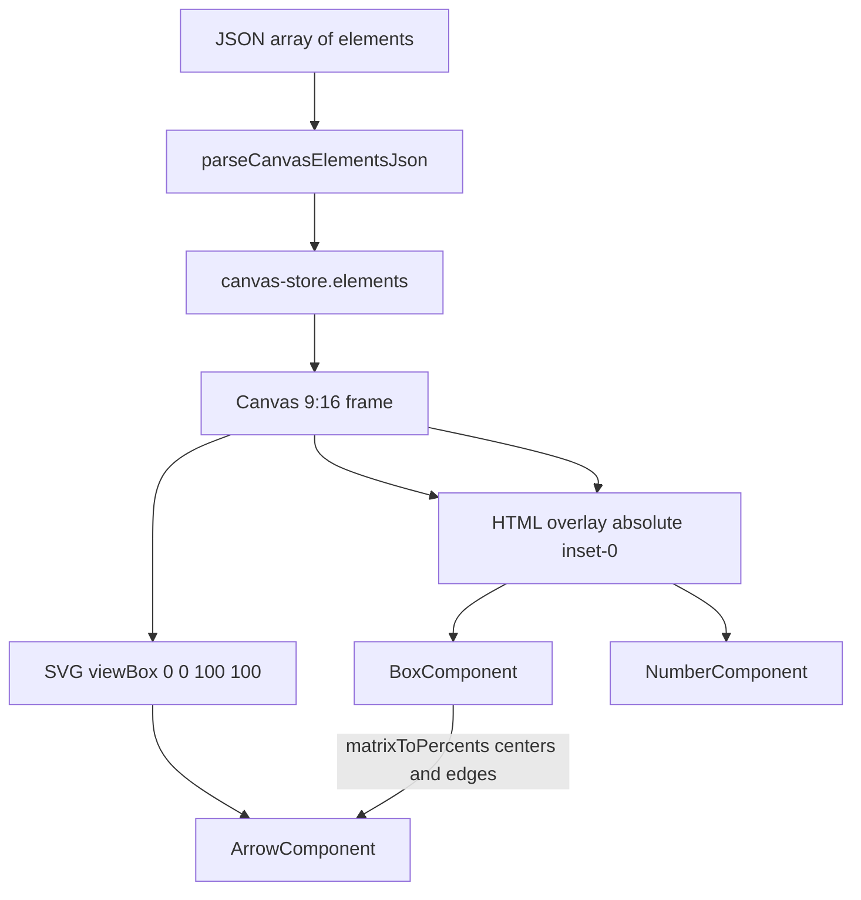

# Reel scene JSON → canvas rendering

This document describes how Krayon’s `/reel-animations` page turns a **JSON array of scene elements** into on-screen UI. It is meant to be loaded into Gemini so later conversation can stay grounded in the real mapping.

**In scope:** element JSON schema, config field names (JSON keys vs inspector labels), and how those objects become boxes, numbered badges, and arrows on the 9:16 reel frame.

**Out of scope:** timeline UI, playback, export, reel-preview chrome, and canvas skins (filled vs sketch). `colorTheme` is documented only as a **per-element fill palette**, not as an app-wide skin.

Source of truth:

- Types: `src/frontend/types/canvas.ts`
- Parse / apply JSON: `src/frontend/lib/parse-canvas-json.ts`
- Seed scene + live array: `src/frontend/stores/canvas-store.ts` (`elements`)
- Layout + routing: `src/frontend/components/canvas/Canvas.tsx`, `src/frontend/lib/canvas-geometry.ts`
- Widgets: `BoxComponent.tsx`, `NumberComponent.tsx`, `ArrowComponent.tsx`

---

## 1. Mental model

The scene is **not** a nested document. It is a **flat array**. Each object is one drawable with a `type` discriminator.

```text
JSON array  →  parseCanvasElementsJson  →  canvas-store.elements
                                              ↓
                                    Canvas (CSS 9:16 frame)
                         ┌────────────────────┴────────────────────┐
                         ▼                                         ▼
              SVG  viewBox="0 0 100 100"              HTML overlay (absolute inset-0)
              arrows only (percent units)             boxes + number badges (grid → %)
```



**Boxes and numbers are HTML**, not SVG shapes. **Arrows are SVG**. JSON layout is an **18×32 cell grid** (`matrix`). At render time `matrixToPercents` converts cells to **percent of the reel (0–100)**. The SVG uses `preserveAspectRatio="none"` so percent `left/top` on HTML matches SVG user units.

You edit the same array in the inspector **JSON** tab. On blur or Cmd/Ctrl+Enter, `parseCanvasElementsJson` replaces `elements`. Invalid JSON or an invalid object is rejected; the canvas is not updated.

---

## 2. How JSON enters the renderer

1. Root value **must be an array**. A bare object `{ ... }` is invalid.
2. Each index must be an object with string `type`.
3. Allowed `type` values: `"box" | "number" | "arrow"`. Anything else fails parse (`unknown type`).
4. Extra properties on an object are ignored; **missing required fields** make that index fail (e.g. `Element 3 is not a valid box.`).
5. There is no wrapping `{ "elements": [...] }` envelope. The file / textarea **is** the array.

The live array is `useCanvasStore().elements`. `Canvas` reads that array every render.

---

## 3. Shared geometry: 18×32 grid

The reel frame is `aspect-[9/16]`. Authors place boxes and numbers on a discrete grid so layouts stay aligned and overlap less.

| Constant | Value |
| --- | --- |
| Columns | **18** (0–17) |
| Rows | **32** (0–31) |
| Cell width | `100 / 18` % of canvas width |
| Cell height | `100 / 32` % of canvas height |
| Origin | Top-left cell `[0, 0]` |

`matrix` is **0-indexed and inclusive**.

| Shape | JSON `matrix` | Meaning |
| --- | --- | --- |
| Box | `[X1, Y1, X2, Y2]` (always length 4) | Occupies every cell from start col/row through end col/row |
| Number | `[X, Y]` or `[X1, Y1, X2, Y2]` | One cell, or a span. Length 2 is treated as `[X, Y, X, Y]` |

Mapping (`matrixToPercents`):

```text
left   = X1 * (100 / 18)
top    = Y1 * (100 / 32)
width  = (X2 - X1 + 1) * (100 / 18)
height = (Y2 - Y1 + 1) * (100 / 32)
```

Boxes and numbers use those percents as CSS `left` / `top` / `width` / `height`. Number badges also set `aspect-ratio: 1` using the mapped **width** as diameter so they stay circular on 9:16.

**Parse rules** (`parseCanvasElementsJson`):

- Every `matrix` entry must be an **integer** (floats fail).
- `0 ≤ X1 ≤ X2 ≤ 17` and `0 ≤ Y1 ≤ Y2 ≤ 31`. Do **not** swap inverted ranges; `X2 < X1` is invalid.
- Box `matrix` length must be **4**. Number length must be **2 or 4**.

The Config form still shows derived percent X / Y / Width / Height (and Size for badges). Those fields snap back onto the grid via `percentsToMatrix`. **Always write `matrix` in JSON**, never `x` / `y` / `width` / `height` / `size`.

**Authoring rule:** overlapping boxes is allowed. Two boxes with the same `id` is allowed by the parser but is a bad idea (`id` is the lookup key for arrows and selection).

Typical seed layout on this grid:

- Step badges: cols **0–1**, 2×2 cells, same start row as the paired box.
- Main stack: cols **2–15**, three rows each, one-row gap between boxes for arrows.
- Callouts: cols **10–16**, overlapping the right side of a box (`track` 0 draws on top).

---

## 4. What actually paints (hybrid canvas)

`Canvas` splits the array:

| Filter | Destination | React component |
| --- | --- | --- |
| `type === "arrow"` | Full-size SVG underlay | `ArrowComponent` as `<line>` / `<path>` inside `<svg>` |
| `type === "box"` | HTML overlay | `BoxComponent` as `position: absolute` `<div>` |
| `type === "number"` | HTML overlay | `NumberComponent` as `position: absolute` circular `<div>` |

SVG is `pointer-events-none` except a fat invisible stroke on each arrow for hit-testing. HTML nodes sit **on top** of the SVG, so boxes cover arrow shafts where they overlap.

### Presence and stacking (JSON `time` only)

Every element **must** include `time: { start, end, track }`. Numbers are seconds on the reel clock; this doc does not describe the timeline editor.

- An element is drawn only if `currentTime` is in the half-open interval **`[start, end)`**.
- **`track` is z-order, not a visual “lane” on the reel.** Track **0 is on top** (highest z). Higher track index paints first (further back).
- HTML `z-index` is `100 - track`.
- Sort used before mapping: descending `time.track`.

---

## 5. Supported UI elements

### 5.1 `box` — labeled rectangle

Rendered by `BoxComponent`. CSS `left/top/width/height` come from `matrixToPercents(matrix)`. Inner UI is a rounded rectangle with a **bold `label`** and optional **`sublabel`** under it.

**JSON keys (config):**

| JSON key | Inspector label | Required | Meaning on canvas |
| --- | --- | --- | --- |
| `id` | (identity, not a layout field) | yes | Stable string. Arrows use this as `sourceId` / `targetId`. |
| `type` | — | yes | Must be `"box"`. |
| `matrix` | (JSON only; Config shows derived X/Y/Width/Height) | yes | `[X1, Y1, X2, Y2]` inclusive cells on the 18×32 grid. |
| `label` | Label | yes | Primary text inside the box. |
| `sublabel` | Sublabel | no | Secondary line under `label`. Empty string is treated as absent. Font size = 75% of the label size. |
| `fontSize` | Font Size | no | Label font size in **CSS pixels**. Default **14**. Inspector clamps **10–48**. |
| `colorTheme` | Color Theme | yes | Fill token (see palette below). `ink` uses inverted text (light on dark fill). |
| `time` | Start / End (and track in JSON) | yes | `{ start, end, track }` as above. |

Inspector labels are JSON keys run through `humanizeCamelCase` (`colorTheme` → “Color Theme”, `fontSize` → “Font Size”). **Always write camelCase in JSON.**

**Seed example:**

```json
{
  "id": "api-gateway",
  "type": "box",
  "matrix": [2, 5, 15, 7],
  "label": "API Gateway",
  "colorTheme": "violet",
  "time": { "start": 1, "end": 30, "track": 3 }
}
```

Callout-style box with smaller type:

```json
{
  "id": "callout-rest",
  "type": "box",
  "matrix": [10, 9, 16, 11],
  "label": "REST + WS",
  "colorTheme": "lavender",
  "fontSize": 12,
  "time": { "start": 7, "end": 12, "track": 0 }
}
```

---

### 5.2 `number` — circular step badge

Rendered by `NumberComponent`. CSS: `left` / `top` / `width` from `matrixToPercents`; `aspect-ratio: 1` so the badge is a circle. The **visible glyph is `value`** (a number), not a text `label`.

**JSON keys (config):**

| JSON key | Inspector label | Required | Meaning on canvas |
| --- | --- | --- | --- |
| `id` | — | yes | Stable string. |
| `type` | — | yes | Must be `"number"`. |
| `matrix` | (JSON only; Config shows derived X/Y/Size) | yes | `[X, Y]` one cell, or `[X1, Y1, X2, Y2]` span. Seed badges use 2×2: `[0, r, 1, r+1]`. |
| `value` | Value | yes | Digit(s) drawn in the center. |
| `colorTheme` | Color Theme | yes | Fill token for the circle. |
| `time` | Start / End | yes | `{ start, end, track }`. |

A `number` is **not** a valid arrow endpoint. `sourceId` / `targetId` may only name **`box` ids**.

**Seed example:**

```json
{
  "id": "step-1",
  "type": "number",
  "matrix": [0, 1, 1, 2],
  "value": 1,
  "colorTheme": "ink",
  "time": { "start": 0, "end": 3, "track": 1 }
}
```

---

### 5.3 `arrow` — connector between two boxes

Rendered by `ArrowComponent` inside the SVG. The JSON has **no `matrix`**. Endpoints are computed from the current grid geometry of two boxes.

**JSON keys (config):**

| JSON key | Inspector label | Required | Meaning on canvas |
| --- | --- | --- | --- |
| `id` | — | yes | Stable string. |
| `type` | — | yes | Must be `"arrow"`. |
| `sourceId` | Source Id | yes | `id` of the **box** the shaft starts from. |
| `targetId` | Target Id | yes | `id` of the **box** the arrowhead points to. |
| `variant` | Variant | no | `"solid"` (default look) or `"dashed"` (`stroke-dasharray: 6 5`). Any other value is dropped at parse time. |
| `time` | Start / End | yes | `{ start, end, track }`. |

**How SVG geometry is derived** (`getArrowGeometry`):

1. Find boxes with `findBoxById(elements, sourceId)` and `targetId`. If either is missing, **render nothing**.
2. Convert each box `matrix` with `matrixToPercents` to a percent rect `{ left, top, width, height }`.
3. Compute each box’s **center**: `(left + width/2, top + height/2)`.
4. Ray from source center to target center; intersect each **axis-aligned rect** so the line starts/ends on the box **edge**, not the center.
5. Nudge each end **0.75 percent** along the unit vector (`ENDPOINT_GAP`) so the stroke does not sit on the border.
6. If distance is 0 (overlapping identical centers), skip render.
7. Draw `<line x1 y1 x2 y2>` in the `0–100` viewBox and attach `marker-end` (filled triangle) at the target.

The SVG layer receives **all boxes** from the store (not only currently visible ones) when resolving ids, but the **arrow itself** is only mounted if the arrow’s `time` window is active. If the source/target box is off-screen this frame, the arrow still uses that box’s stored `matrix`.

**Seed examples:**

```json
{
  "id": "client-to-gw",
  "type": "arrow",
  "sourceId": "client",
  "targetId": "api-gateway",
  "variant": "solid",
  "time": { "start": 2.2, "end": 30, "track": 7 }
}
```

```json
{
  "id": "gw-to-lambda",
  "type": "arrow",
  "sourceId": "api-gateway",
  "targetId": "lambda",
  "variant": "dashed",
  "time": { "start": 6.5, "end": 30, "track": 8 }
}
```

---

## 6. `colorTheme` tokens (element fill)

Used by **box** and **number** only. Arrows do not have `colorTheme`; they stroke with the canvas ink color.

Allowed strings (parse rejects anything else):

`ink` · `violet` · `green` · `blue` · `sky` · `lavender` · `mint` · `tan` · `yellow` · `orange` · `pink` · `salmon`

These map to CSS variables `--canvas-*` (for example `violet` → `bg-canvas-violet`). They are **not** the Bright / sketch appearance modes.

---

## 7. Required `time` object

Present on every type. Parse checks that `start`, `end`, and `track` are finite numbers. It does not require `end > start`.

```json
"time": { "start": 0, "end": 30, "track": 2 }
```

| Key | Role for drawing |
| --- | --- |
| `start` | Inclusive lower bound of visibility (seconds). |
| `end` | Exclusive upper bound of visibility (seconds). |
| `track` | Integer z-order: **0 = front**. |

---

## 8. Authoring checklist for Gemini

When proposing or rewriting scene JSON:

1. Emit a **JSON array**, not an object wrapper.
2. Every item needs unique `id` and a valid `type`.
3. Boxes need `matrix` `[X1, Y1, X2, Y2]`, `label`, `colorTheme`, `time`. Integers only; stay inside 18×32; `X1 ≤ X2`, `Y1 ≤ Y2`.
4. Numbers need `matrix` (`[X, Y]` or four numbers), `value`, `colorTheme`, `time`. Do not point arrows at them.
5. Arrows need `sourceId` and `targetId` that match **existing box `id`s**. Optional `variant`: `"solid"` or `"dashed"`.
6. Do not emit `x`, `y`, `width`, `height`, or `size`. `label` / `sublabel` are the only user-facing strings on a box; `value` is the only user-facing number on a badge.
7. Prefer the seed packing: badges in cols 0–1, main boxes in cols 2–15, callouts in cols 10–16.
8. Use inspector **labels** only when talking to a human about the Config form. In JSON, use the **camelCase keys** in the tables above.

---

## 9. Minimal valid scene

Three objects: two boxes and one arrow. At `currentTime = 0` everything in `[0, 10)` is visible.

```json
[
  {
    "id": "a",
    "type": "box",
    "matrix": [2, 4, 15, 7],
    "label": "Source",
    "colorTheme": "sky",
    "time": { "start": 0, "end": 10, "track": 1 }
  },
  {
    "id": "b",
    "type": "box",
    "matrix": [2, 16, 15, 19],
    "label": "Target",
    "sublabel": "optional second line",
    "colorTheme": "green",
    "time": { "start": 0, "end": 10, "track": 2 }
  },
  {
    "id": "a-to-b",
    "type": "arrow",
    "sourceId": "a",
    "targetId": "b",
    "variant": "solid",
    "time": { "start": 0, "end": 10, "track": 5 }
  }
]
```

HTML places `a` and `b` as rectangles from their `matrix` cells. SVG draws a line from the bottom edge of `a` to the top edge of `b` (plus gap), with an arrowhead on `b`.
