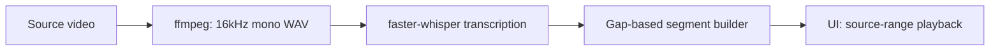

# Silence Removal Pipeline

Krayon removes dead air from talking-head recordings using **faster-whisper** word timestamps and gap-based segment building. Ported from [`krayon-reel/scripts/transcribe_and_cut.py`](../../krayon-reel/scripts/transcribe_and_cut.py).

For a stage-by-stage breakdown of the **Analyze silence** stepper (what each step does, progress weighting, inputs/outputs, and disk artifacts), see [pipeline-stages.md](./pipeline-stages.md).

## Flow



## Algorithm

1. Extract 16 kHz mono PCM WAV via ffmpeg
2. Transcribe with faster-whisper (`word_timestamps=True`, VAD filter)
3. Build speech segments from inter-word gaps:
   - Expand each word by `pad` (default **0.05s**)
   - Merge when gap ≤ `silence_threshold` (default **0.4s**)
   - Drop spans shorter than **0.05s**

## Configuration

| Setting | Default | Env / API |
|---------|---------|-----------|
| Silence threshold | 0.4s | `options.silenceThreshold` |
| Pad | 0.05s | `options.pad` |
| Language | en | `options.language` |
| Whisper model | base | `krayon.toml` `[whisper] model` |

## Backend modules

```
src/backend/app/services/
├── ffmpeg.py       # audio extraction, probing
├── transcribe.py   # faster-whisper wrapper
├── segments.py     # build_segments_from_words
├── analysis.py     # orchestrates full pipeline
└── clips.py        # segment metadata + fuzzy grouping
```

## API

### Analyze silence

```http
POST /api/silence/analyze
Content-Type: application/json

{
  "path": "/Users/you/Videos/recording.mov",
  "options": {
    "silenceThreshold": 0.4,
    "pad": 0.05,
    "language": "en",
    "threads": 4
  }
}
```

Response:

```json
{
  "sourceDuration": 130.5,
  "fps": 30,
  "segments": [{ "sourceStart": 0.1, "sourceEnd": 12.4 }],
  "removedSeconds": 45.2,
  "words": [{ "text": "hello", "start": 0.5, "end": 0.8 }]
}
```

### Async with SSE progress

```http
POST /api/silence/analyze/async   → { "jobId": "..." }
GET  /api/silence/progress/{jobId}  → text/event-stream
```

## UI integration

- **Right panel → Analyze silence** runs the full async pipeline (transcribe + segment + group)
- **Analysis run** dropdown appears when prior runs exist; switch versions without re-analyzing
- **Speech clips only / Show all segments** toggles the left sidebar list mode
- Opening the editor restores the last active run from `.krayon/state/{mediaId}/`

## Persisted state

After each pipeline run completes, Krayon writes versioned state next to the source file:

```
.krayon/state/{mediaId}/
  index.json
  versions/{versionId}/
    manifest.json
    transcript.txt
    audio/
```

- **Append-only** — re-analyzing creates a new version folder; prior manifests are never deleted
- **index.json** — version list with auto labels (`Run 1 · Aug 23, 7:05 PM`), `activeVersionId`, summary stats
- **manifest.json** — silence options, analysis (including word timings), clips (timestamps + text + per-clip words + groups), and full `transcript`
- **transcript.txt** — plain-text full-run transcript for comparing versions on disk

### State API

```http
GET /api/editor/state/{mediaId}              → active manifest + version list (null if none)
GET /api/editor/state/{mediaId}/versions/{id} → specific version
PUT /api/editor/state/{mediaId}/active       → { "versionId": "..." }
```

### Clip preview

Speech clips play as **extracted audio WAVs** served from `/api/media/clip/{mediaId}/{clipId}`. Files are written during the extracting_audio pipeline stage.

## Clip grouping

After segment metadata is built, clips with similar transcript text are grouped using normalized fuzzy string matching plus shared-prefix detection (default threshold **0.5**). Takes that share the same opening line (common in retakes) merge even when the rest of the transcript diverges.

## Tool check

```http
GET /api/tools/status
```

Returns `{ ffmpeg, ffprobe, whisperReady, whisperModel }`.
