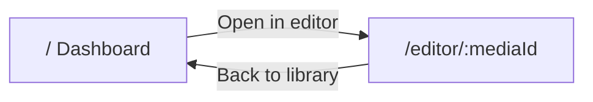

# UI Design

Krayon uses a two-page flow: a **library dashboard** for browsing videos and an **editor** for processing a single video.

## Pages

| Route | Page | Purpose |
|-------|------|---------|
| `/` | Dashboard | Folder + video library, preview, metadata |
| `/editor/:mediaId` | Editor | Single-video processing workspace |



## Dashboard layout

```
┌─────────────────────────────────────────────────────────────┐
│  Krayon                                         library      │
├──────────┬──────────────────────────────┬───────────────────┤
│ Library  │         Video preview        │   Video details   │
│ (videos) │         (center)             │  + Open in editor │
└──────────┴──────────────────────────────┴───────────────────┘
```

- **Left** — `LibrarySidebar`: folder path, Open folder, video list
- **Center** — `VideoPlayer`: preview selected video
- **Right** — `DashboardPanel`: metadata + **Open in editor** button

No silence removal or clip controls on the dashboard.

## Editor layout

While **Analyze silence** is running, the center panel shows `PipelineStepper` (vertical step list with per-step % and elapsed time). When complete, it switches back to `VideoPlayer`. See [pipeline-stages.md](./pipeline-stages.md) for what each step does under the hood.

```
┌─────────────────────────────────────────────────────────────┐
│  ← Back to library   Krayon                    video.mov    │
├──────────┬──────────────────────────────┬───────────────────┤
│ Clips    │  Video player OR pipeline    │     Controls      │
│ (after   │  stepper while running       │ Analyze silence,  │
│ analysis)│                              │ list toggle, proxy│
└──────────┴──────────────────────────────┴───────────────────┘
```

- **Left** — `ClipsSidebar`: appears after analysis completes
  - **Speech clips only** (default): grouped similar takes, play icon per row
  - **All segments**: chronological speech + silence rows (silence in mild red)
  - Truncated labels show full text on hover (tooltip)
- **Center** — `VideoPlayer` or `PipelineStepper` during async job
- **Right** — `ControlsPanel`: single **Analyze silence** button (transcribe + cut + group), **analysis run** version selector (when history exists), segment list toggle, proxy, tools

### Clip list interactions

| Action | Behavior |
|--------|----------|
| Click row | Preview in center (paused) |
| Click play icon | Preview and start playback immediately |
| Silence row | Seeks source video to gap range |

## Stack

- **React Router** — `/` and `/editor/:mediaId`
- **Zustand** — shared `media-store` and `silence-store` across routes
- **SSE** — `/api/clips/generate/async` + `/api/clips/progress/{jobId}` for pipeline progress
- **Tailwind CSS v4** — tokens in [`src/frontend/index.css`](../src/frontend/index.css)

## Key components

| Path | Role |
|------|------|
| `src/frontend/pages/DashboardPage.tsx` | Library dashboard |
| `src/frontend/pages/EditorPage.tsx` | Single-video editor |
| `src/frontend/components/layout/LibrarySidebar.tsx` | Video list |
| `src/frontend/components/layout/ClipsSidebar.tsx` | Grouped clips + all-segments timeline |
| `src/frontend/components/layout/DashboardPanel.tsx` | Metadata + Open in editor |
| `src/frontend/components/layout/ControlsPanel.tsx` | Analyze silence + version selector + list mode toggle |
| `src/frontend/components/player/PipelineStepper.tsx` | Pipeline progress UI — see [pipeline-stages.md](./pipeline-stages.md) |
| `src/frontend/components/layout/AppShell.tsx` | Shared header |

## Folder persistence

Last folder path stored in `localStorage` under key `krayon:lastFolder` and restored on app load.

## Editor state persistence

Each **Analyze silence** run is saved under the video folder as versioned state. Re-opening `/editor/:mediaId` restores the last active run (clips sidebar, stats, options) without re-processing.

### On-disk layout

Co-located with the per-folder cache at `{video_folder}/.krayon/`:

```
.krayon/
  state/
    {mediaId}/
      index.json                 # version list + activeVersionId
      versions/
        {versionId}/             # e.g. 2026-08-23T19-05-00_a1b2c3
          manifest.json          # full persisted payload
          clips/
            seg_000.mp4
            ...
```

- **mediaId** — `sha256(resolved_path)[:16]`, same as the editor URL param
- **index.json** — append-only version history; `activeVersionId` points at the newest run after each analysis
- **manifest.json** — options, analysis summary, clips, groups — everything needed to restore the UI

### Version behavior

| Action | Behavior |
|--------|----------|
| Open editor | `GET /api/editor/state/{mediaId}` loads active manifest into stores |
| Re-analyze | Creates a new `versions/{versionId}/` folder; prior runs stay on disk |
| Switch run | Version dropdown in Controls → `PUT /api/editor/state/{mediaId}/active` |
| Clip playback | `/api/media/clip/{mediaId}/{filename}?version={versionId}` |

The version selector appears only when saved history exists. **Analyze silence** never clears prior clips from disk or from the UI until the new run completes.
